# Dead Code Deleter - System Diagrams

Simple visual guides to understand how the system works.

> **Note**: View these diagrams on GitHub, VS Code (with Mermaid extension), or at [Mermaid Live Editor](https://mermaid.live/)

---

## How It Works (Overview)

```mermaid
flowchart LR
    A["1️⃣<br/>Your App Runs"] --> B["2️⃣<br/>Tracks Functions"]
    B --> C["3️⃣<br/>Sends Data"]
    C --> D["4️⃣<br/>View Dashboard"]
    D --> E["5️⃣<br/>Remove Dead Code"]

    style A fill:#d8dee9,stroke:#5e81ac,stroke-width:3px,color:#2e3440
    style B fill:#d8dee9,stroke:#7b1fa2,stroke-width:3px,color:#2e3440
    style C fill:#fff9e6,stroke:#d08770,stroke-width:3px,color:#2e3440
    style D fill:#e8f5e9,stroke:#388e3c,stroke-width:3px,color:#2e3440
    style E fill:#ffe0b2,stroke:#f57c00,stroke-width:3px,color:#2e3440
```

**5 Simple Steps:**
1. Deploy your app with instrumentation
2. Functions are tracked when they run
3. Usage data sent to platform every 10 seconds
4. Open dashboard to see which functions are never used
5. Click button to create PR that removes dead code

---

## The Main Flow

```mermaid
%%{init: {'theme':'base', 'themeVariables': { 'primaryColor':'#88c0d0','primaryTextColor':'#2e3440','primaryBorderColor':'#5e81ac','lineColor':'#5e81ac','secondaryColor':'#a3be8c','tertiaryColor':'#d08770','noteBkgColor':'#d8dee9','noteTextColor':'#2e3440','noteBorderColor':'#5e81ac','actorBkg':'#eceff4','actorBorder':'#5e81ac','actorTextColor':'#2e3440','actorLineColor':'#5e81ac','signalColor':'#2e3440','signalTextColor':'#2e3440','labelBoxBkgColor':'#88c0d0','labelBoxBorderColor':'#5e81ac','labelTextColor':'#2e3440','loopTextColor':'#2e3440','activationBorderColor':'#5e81ac','activationBkgColor':'#d8dee9','sequenceNumberColor':'#2e3440'}}}%%
sequenceDiagram
    participant App as 🚀 Your App
    participant Platform as 📊 Platform
    participant You as 👤 You
    participant GitHub as 🐙 GitHub

    App->>Platform: Sends function usage data<br/>(every 10 seconds)

    You->>Platform: Opens dashboard
    Platform->>You: Shows dead code in red

    You->>Platform: Clicks "Remove Dead Code"
    Platform->>GitHub: Creates PR
    GitHub->>You: PR ready to review & merge
```

**What happens:**
- Your app continuously sends data
- You view the dashboard when you want
- Platform creates PR to GitHub (not your running app!)

---

## The 3 Parts

```mermaid
graph TB
    A["🚀 Your App<br/><br/>Runs in production<br/>Tracks which functions<br/>are actually used"]
    B["📊 Platform<br/><br/>Collects usage data<br/>Shows dashboard<br/>Creates cleanup PRs"]
    C["🐙 GitHub<br/><br/>Your source code<br/>Receives PRs to<br/>remove dead code"]

    A -->|sends data| B
    B -->|creates PR| C

    style A fill:#e3f2fd,stroke:#1976d2,stroke-width:4px,color:#2e3440
    style B fill:#e8f5e9,stroke:#388e3c,stroke-width:4px,color:#2e3440
    style C fill:#ffe0b2,stroke:#f57c00,stroke-width:4px,color:#2e3440
```

**Key Point:** Your running app sends data to Platform. Platform creates PRs in GitHub to update your source code.

---

## What Data is Tracked

**Simple Logic:** If a function's `callCount` is 0, it's dead code and can be safely removed.

## Quick Reference

### Setup Steps

1. **Install** - Add `@dead-code-deleter/instrument` to your Next.js project
2. **Configure** - Add to `next.config.js`
3. **Deploy** - Push to production
4. **Wait** - Let it run for a few days to collect usage data
5. **Clean** - View dashboard and remove dead code via PR

### What Gets Tracked

✅ All function types:
- Function declarations
- Arrow functions
- Class methods
- React components

❌ Excluded:
- Anything in `node_modules`
- Minified code

### Important Notes

- **Data collection happens automatically** - No code changes needed after setup
- **10 second intervals** - Usage data is sent to platform regularly
- **Production tracking** - Best results come from tracking your live app
- **Safe deletion** - Only functions with 0 calls are marked for removal
- **You stay in control** - Review and approve the PR before merging

